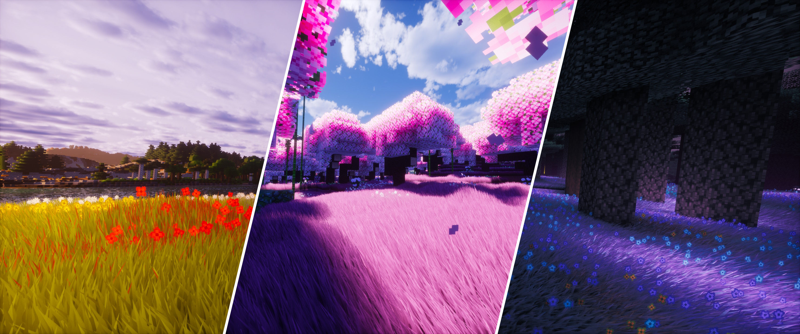
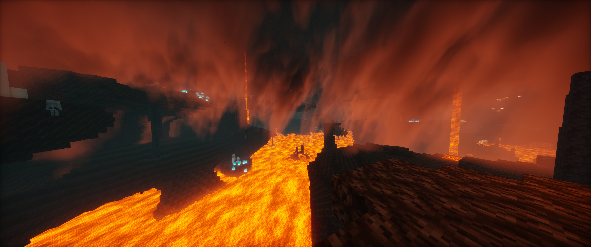
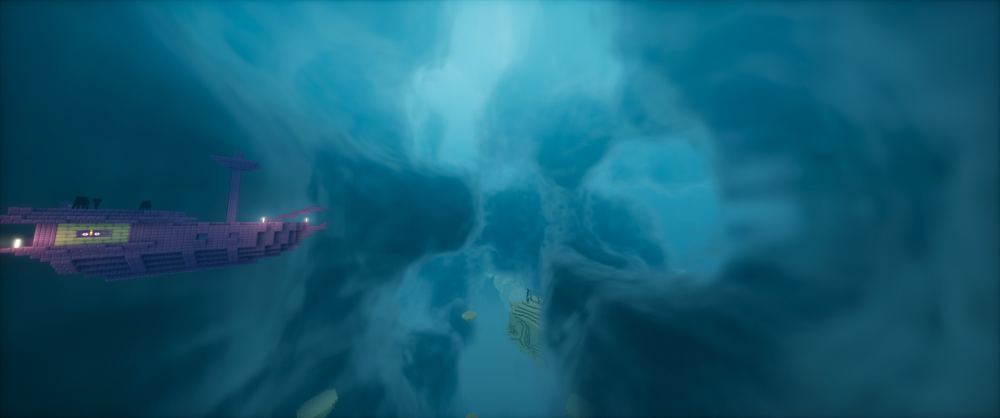
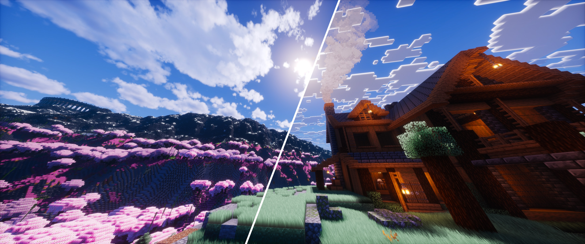
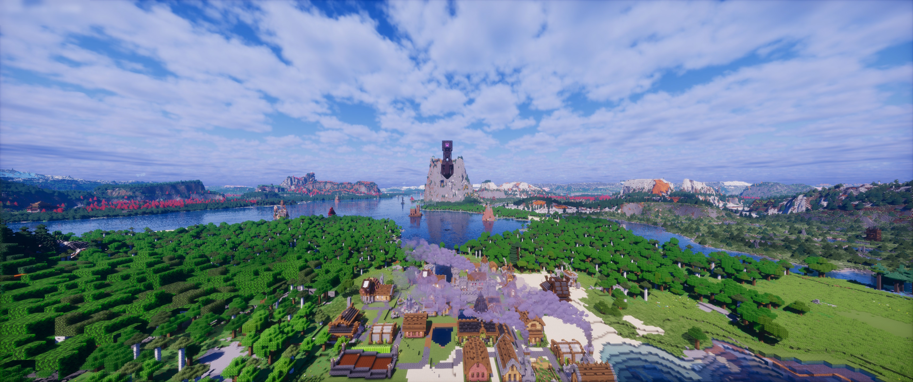
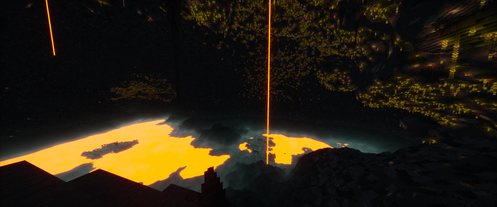

<h1 align = "center">Obsidian Shaders</h1>

A Minecraft shader pack — a fork of <a href="https://github.com/sixthsurge/photon">Photon</a> with new features and fixes.

## Installation

* Obsidian shaders can be used with [Iris](https://irisshaders.dev/download) (recommended) or [OptiFine](https://optifine.net/home) (untested).
* [Release Page](https://github.com/ndalton57/obsidian.shaders/releases) — download the latest release zip and drop it straight into your `.minecraft/shaderpacks` folder.

## New Features and Fixes

* 

  
Shader Grass

  
  
  

* 

  
Nether Overhaul

  
  
  

* 

  
End Overhaul

  
  
  

* 

  
Multiple Cloud Options

  
  
  

* 

  
Voxy and DH Support

  
  
  

* 

  
Bedrock Fog

  
  
  

* Light leak fix for large caves (like JJThunder sized caves, which were still leaking light)
* More incoming...

## Credit

This shader pack is basically just me combining a bunch of my favorite shader features into one pack, and then making improvements, so the real credit goes to all these shaders:

- Obsidian is a fork of [Photon](https://github.com/sixthsurge/photon) by [SixthSurge](https://github.com/sixthsurge)
- Original Shader Grass and GS pipeline implimentation was ported from [Eclipse Shaders](https://github.com/Merlin1809/Eclipse-Shader)
- Overworld Clouds, Nether Lava Plumes, and End clouds were ported from [Bliss Shaders](https://github.com/X0nk/Bliss-Shader)

## License

Obsidian Shaders is distributed under the original Photon Shaders License Agreement (© Benjamin Stott / "SixthSurge"). See [LICENSE](LICENSE) for the full terms.
